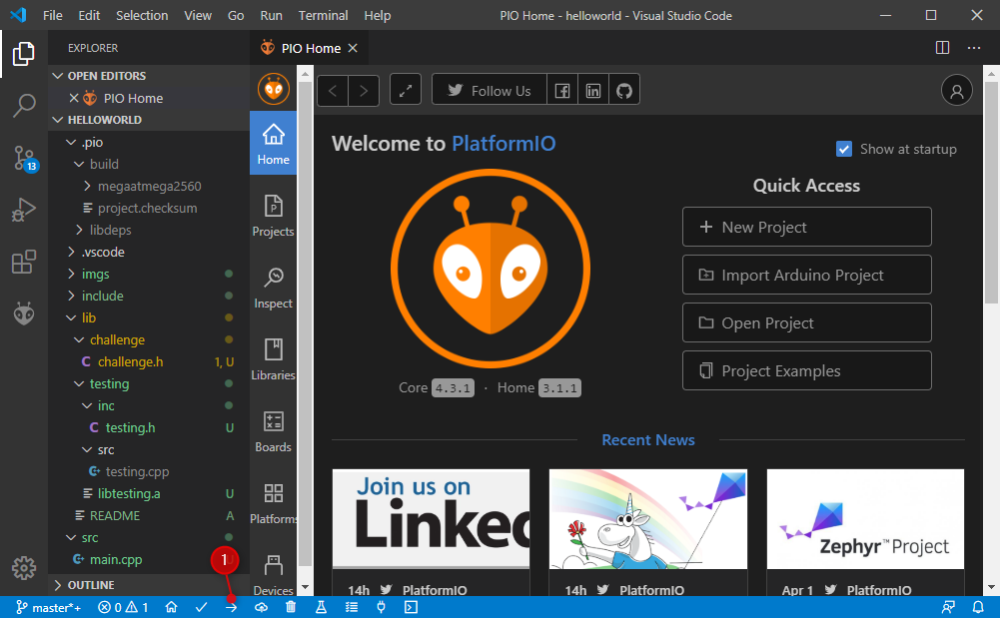
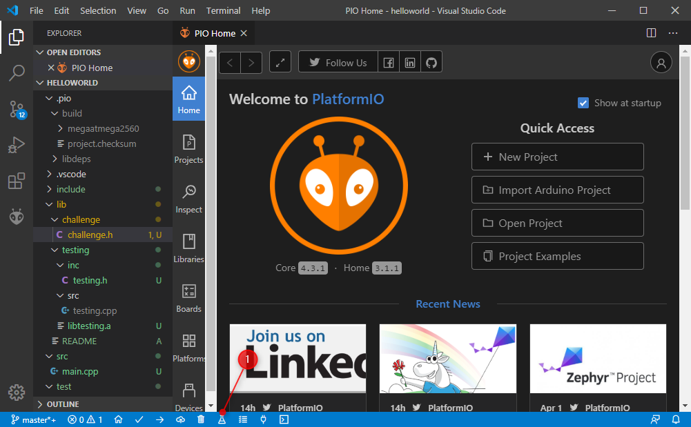

# Hello World Challenge
This is the third challenge of the eLearninga Embedded Challenge Platform.

## Challenge
In this challenge, you need to write a function, that returns with "Hello World!".

### How to solve the challenge
You only have to modify the [lib/challenge/src/challenge.cpp](lib/challenge/src/challenge.cpp) file.

To test your solution, you have to run `PlatformIO: Test` feature.

You can test your code in 2 ways:
* With remote testing
  * You learned it in the previous startup_env challenge
* With local testing
  * You have to update the platformio.ini file for your arduino device.
  * Upload code to local device (`PlatformIO: Upload` feature)
  
  * Test code on local device (`PlatformIO: Test` feature)
  

## Built With
* [Visual Studio Code](https://code.visualstudio.com/) - Programming IDE
* [PlatformIO](https://platformio.org/) - Ecosystem for Embedded Development

## Next challenge: [Dice game](https://github.com/swordey/dice_game)
